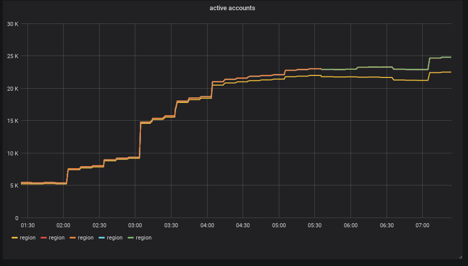

# ascii-grafana

Renders a grafana dashboard (and panels), such as:



as ascii text in a terminal:

```
$ ascii-grafana dashboard --config config.ini --dashboard r1Z9fxWZk

                                        active accounts

  25000 +-+---+-----+-----+-----+-----+-----+-----+----+-----+-----+-----+-----+-----+---+-+
        +           +           +           +          +           +           +           +
        |                                                                       BBBB       |
        |                                       BBBBBBBBBBBBBBBBBBBBBBBBBBBBBBBBB          |
  20000 +-+                                 BBBBB                                        +-+
        |                                   B                                              |
        |                             BBBBBBB                                              |
        |                             B                                                    |
  15000 +-+                       BBBBB                                                  +-+
        |                        BB                                                        |
        |                        B                                                         |
        |                                                                                  |
        |                       B                                                          |
  10000 +-+                  BBBB                                                        +-+
        |                BBBBB                                                             |
        |           BBBBBB                                                                 |
        |           B                                                                      |
   5000 +-+ BBBBBBBBB                                                                    +-+
        |                                                                                  |
        |                                                                       EEEE       |
        +           +           +           +     EEEEEEEEEEEEEEEEEEEEEEEEEEEEEEE          +
      0 +-+-CCCCCCCCCCCCCCCCCCCCCCCCCCCCCCCCCCCCCCCCCCCCCCCCCCAAAAAAAAAAAAAAAAAAAAAA-+---+-+
      01:00       02:00       03:00       04:00      05:00       06:00       07:00       08:00
```

